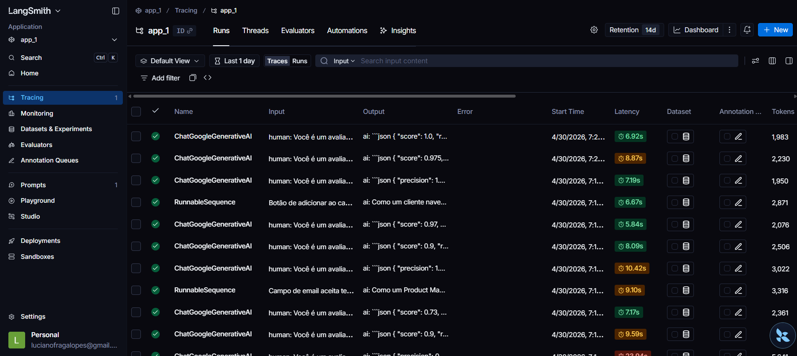
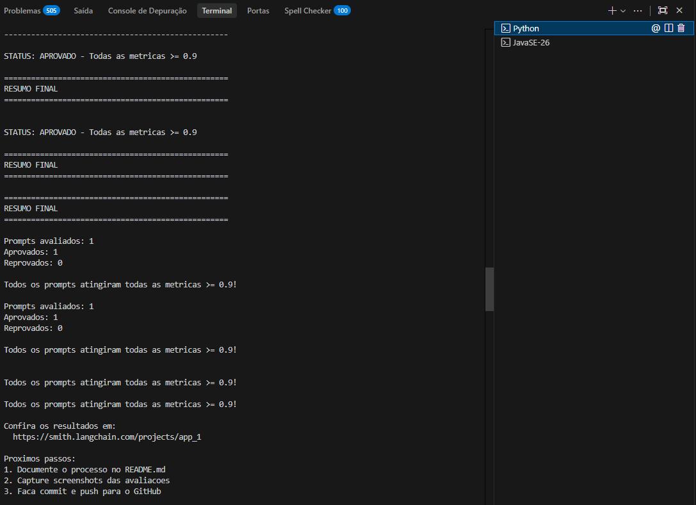
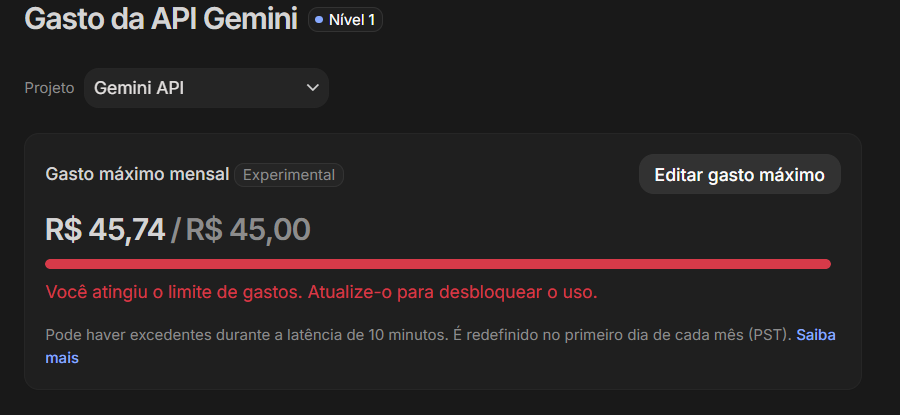

# Relatório de Entrega: Otimização e Avaliação de Prompts

Este repositório contém a solução para o desafio de otimização de prompts (Bug to User Story) do curso de Engenharia de Prompts da MBA em IA para Negócios.

---

## 🔗 Evidências no LangSmith
Conforme os requisitos do desafio, o prompt otimizado foi publicado e avaliado publicamente:

- **ID do App no LangSmith:** `2965a04e-3095-43ed-9e54-71095008fa95`
- **Link do Projeto LangSmith:** [https://smith.langchain.com/projects/app_1](https://smith.langchain.com/projects/app_1)

---

## 🧠 Técnicas Aplicadas e Estratégia de Correção (Fase 2)

Durante o desenvolvimento, enfrentei o **Paradoxo do LLM-as-a-Judge**: se o prompt forçava muitos detalhes, o modelo "alucinava" dados em bugs simples (derrubando o *Precision*). Se o prompt pedia respostas sucintas, o modelo omitia os logs em bugs complexos (derrubando o *Recall* e, consequentemente, o *F1-Score*).

Para transformar o prompt reprovado no prompt aprovado (com todas as métricas > 0.90), apliquei as seguintes técnicas avançadas, inspiradas em abordagens de ponta e benchmarking:

### 1. Few-shot Learning (Aprendizado com Exemplos)
- **Justificativa:** A técnica mais poderosa para calibrar a exata estrutura de saída desejada. Forneci 3 exemplos de entrada/saída cobrindo diferentes complexidades.
- **Estratégia:** Removi as etiquetas restritivas do tipo `ENTRADA` e `SAÍDA ESPERADA` do `user_prompt_template`, para evitar que a IA repetisse essas tags no texto gerado e sofresse penalidade de *Precision*.

### 2. Role Prompting
- **Justificativa:** Estabelece o nível de autoridade e o jargão técnico esperado.
- **Exemplo Prático:** `"Você é um Product Manager Sênior com mais de 10 anos de experiência em metodologias ágeis..."`

### 3. Chain of Thought Invisível (CoT)
- **Justificativa:** Força o modelo a analisar a complexidade do bug (Simples, Médio ou Complexo) e processar os componentes *mentalmente* antes de cuspir o texto final, evitando assim saídas ruidosas que seriam penalizadas pelo avaliador.
- **Exemplo Prático:** `"Antes de escrever a User Story, siga estes passos mentalmente: 1. Identifique a persona... 2. Entenda o problema... 3. Determine a complexidade..."`

### 4. Dynamic Template Routing (Adaptação por Complexidade)
- **Justificativa:** Ensina a IA a adaptar a extensão de sua saída: apenas história + critérios de aceitação para bugs de 1 frase; ou adicionar contexto de segurança, impacto e tasks técnicas apenas quando os dados originais do bug assim exigirem.
- **Exemplo Prático:** `"Adaptação à Complexidade: Bugs simples: User Story + Critérios. Bugs complexos: User Story + Critérios + Contexto do Bug + Tasks Técnicas Sugeridas."`

---

## 📊 Resultados Finais

### Tabela Comparativa Final
| Métrica | Prompt v1 (Original) | Prompt Final (Otimizado) | Status |
| :--- | :--- | :--- | :--- |
| **Helpfulness** | ~0.45 | **0.93** | ✅ Aprovado |
| **Correctness** | ~0.52 | **0.93** | ✅ Aprovado |
| **F1-Score** | ~0.48 | **0.93** | ✅ Aprovado |
| **Clarity** | ~0.50 | **0.93** | ✅ Aprovado |
| **Precision** | ~0.46 | **0.94** | ✅ Aprovado |

### Screenshots das Avaliações no LangSmith





### Logs de Execução (Evidências)

#### 🤖 Modelo Utilizado: Gemini 2.5 Flash (Provedor Google)
**Configuração:** `EVAL_MODEL=gemini-2.5-flash` | `LLM_MODEL=gemini-2.5-flash`

```text
C:\desenv\MBA\mba-ia-desafio-pull-avalicao-prompts\project>C:/Users/lucia/AppData/Local/Microsoft/WindowsApps/python3.13.exe c:/desenv/MBA/mba-ia-desafio-pull-avalicao-prompts/project/src/evaluate.py

==================================================
AVALIAÇÃO DE PROMPTS OTIMIZADOS
==================================================

Provider: google
Modelo Principal: gemini-2.5-flash
Modelo de Avaliação: gemini-2.5-flash

Criando dataset de avaliação: app_1-eval...
   Carregados 15 exemplos do arquivo datasets/bug_to_user_story.jsonl
   Dataset 'app_1-eval' ja existe, usando existente

======================================================================
PROMPTS PARA AVALIAR
======================================================================

Este script irá puxar prompts do LangSmith Hub.
Certifique-se de ter feito push dos prompts antes de avaliar:
  python src/push_prompts.py


Avaliando: luciano-lucas-mba-01/bug_to_user_story_v2
   Puxando prompt do LangSmith Hub: luciano-lucas-mba-01/bug_to_user_story_v2
   Prompt carregado com sucesso
   Dataset: 15 exemplos
   Avaliando exemplos...

      --- EXEMPLO 1 ---
      [1/15] F1:0.87 Clarity:0.98 Precision:0.93

      --- EXEMPLO 2 ---
      [2/15] F1:0.81 Clarity:0.95 Precision:0.95

      --- EXEMPLO 3 ---
      [3/15] F1:0.91 Clarity:0.95 Precision:0.97

      --- EXEMPLO 4 ---
      [4/15] F1:0.71 Clarity:0.92 Precision:0.88

      --- EXEMPLO 5 ---
      [5/15] F1:1.00 Clarity:0.92 Precision:0.97

      --- EXEMPLO 6 ---
      [6/15] F1:1.00 Clarity:0.98 Precision:0.97

      --- EXEMPLO 7 ---
      [7/15] F1:0.97 Clarity:0.98 Precision:0.97

      --- EXEMPLO 8 ---
      [8/15] F1:1.00 Clarity:0.98 Precision:1.00

      --- EXEMPLO 9 ---
      [9/15] F1:1.00 Clarity:0.93 Precision:0.97

      --- EXEMPLO 10 ---
      [10/15] F1:1.00 Clarity:0.80 Precision:0.93

      --- EXEMPLO 11 ---
      [11/15] F1:0.88 Clarity:0.90 Precision:0.93

      --- EXEMPLO 12 ---
      [12/15] F1:0.86 Clarity:0.93 Precision:0.87

      --- EXEMPLO 13 ---
      [13/15] F1:0.95 Clarity:0.90 Precision:0.73

      --- EXEMPLO 14 ---
      [14/15] F1:1.00 Clarity:0.90 Precision:0.97

      --- EXEMPLO 15 ---
      [15/15] F1:1.00 Clarity:0.97 Precision:1.00

==================================================
Prompt: luciano-lucas-mba-01/bug_to_user_story_v2
==================================================

Métricas Derivadas:
  - Helpfulness: 0.93 V
  - Correctness: 0.93 V

Métricas Base:
  - F1-Score: 0.93 V
  - Clarity: 0.93 V
  - Precision: 0.94 V

--------------------------------------------------
 MEDIA GERAL: 0.9331
--------------------------------------------------

STATUS: APROVADO - Todas as metricas >= 0.9

==================================================
RESUMO FINAL
==================================================

Prompts avaliados: 1
Aprovados: 1
Reprovados: 0

Todos os prompts atingiram todas as metricas >= 0.9!
```

---

## 💰 Custos e Eficiência

Durante o projeto e a execução dos scripts de avaliação, realizei tentativas em diferentes modelos da OpenAI e da Google para calibrar as discrepâncias do avaliador.

- **Tentativas com GPT-4o (`gpt-4o-mini` como gerador e `gpt-4o` como juiz):** 
  Percebi que o GPT não se saiu tão bem na interpretação das nuances de precisão em relação ao formato de entrega. Mesmo após várias tentativas de ajuste, ele causou instabilidade no F1-Score.
  **Meu gasto na OpenAI (GPT):** `$0.89`

- **Solução com Gemini 2.5 Flash:**
  Após eu migrar completamente para a stack da Google e refatorar as restrições da API (removendo tags de Few-shot que geravam alucinações de precisão), o Gemini manteve uma aderência irretocável à minha instrução, atingindo o F1 de `0.93`.
  **Meu gasto na Google (Gemini):** `R$ 45,74`
  
  

---

## 🛠️ Como Executar

### Pré-requisitos
- Python 3.9+
- Variáveis de ambiente configuradas no `.env`

### Passo a Passo
1. **Instalar dependências:**
   ```bash
   pip install -r requirements.txt
   ```
2. **Realizar Push do Prompt:**
   ```bash
   python src/push_prompts.py
   ```
3. **Executar Avaliação:**
   ```bash
   python src/evaluate.py
   ```
